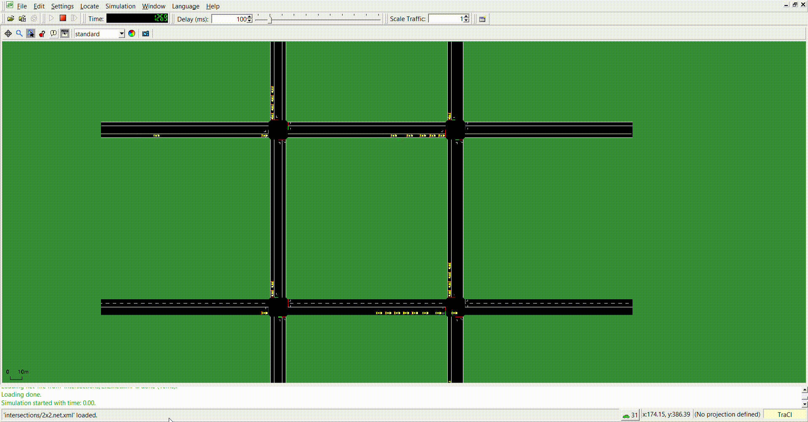

# Deep Q-Learning for Intelligent Traffic Light Control

This project applies **Deep Reinforcement Learning (DQN)** to optimize traffic light control using the **SUMO traffic simulator** and a **custom Gym environment**.  
It demonstrates how intelligent agents can learn to minimize traffic congestion and vehicle waiting times through experience-based decision-making.

---

## Objective
To develop an AI-based traffic light control system that adapts to real-time traffic flow and reduces congestion compared to traditional or random switching methods.

---

## Methodology

### Random Agent (Baseline)
A non-learning agent that switches lights randomly — used as a benchmark for comparison.  
- **Result:** 120 cars queued at peak.

### Deep Q-Learning Agent
A reinforcement learning model that uses **neural networks** to estimate Q-values and learn optimal switching policies.  
- **Result:** Queue reduced to **30 cars**, showing a **75% improvement** in efficiency.  
- Learns from environment feedback using experience replay, target network updates, and ε-greedy exploration.

---

## Technical Highlights
- **Frameworks:** TensorFlow, SUMO-RL, Gymnasium  
- **Algorithm:** Deep Q-Learning with target networks and experience replay  
- **Architecture:** Two-layer fully connected neural network (ReLU activation)  
- **Optimization:** Adam optimizer, mean squared error loss  
- **Environment:** Multi-agent intersection (2×2 and 3×3 grid layouts)  

---

## 📈 Key Achievements
- Reduced vehicle waiting time and queue length by over **70%** compared to random control.  
- Implemented **multi-agent DQN training** with independent experience buffers.  
- Designed a realistic **SUMO-based environment** for RL experimentation.  
- Demonstrated how **reinforcement learning can improve real-world traffic management** systems.
